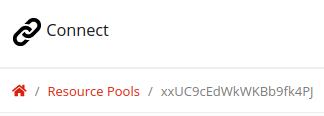

# Connect Webview
This is an example of how to build a page for Connect.

Click [here](https://hrst-connect.github.io/connect-webview-visualize/) to see the example in your web-browser. Note, however, that this webpage will only operate correctly on Connect.

## Usage
### Resource Pool
To call a resource-pool, add your `RESOURCE_POOL_ID` [here](https://github.com/hrst-connect/connect-webview-visualize/blob/49aab30661ffc328955baddbbcd03f23bd789f84/js/resource-pool.js#L1). You can find your resource pool ID in the Connect webapp under `Resource Pools`. In the example below, the resource pool ID is `xxUC9cEdWkWKBb9fk4PJ`.

## API
Documentation for the API can be found [here](https://connect-webview.readthedocs.io/).
